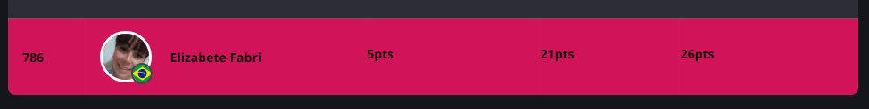

<h1>
    
    Dio - Bootcamps Santander 2023
</h1>

    

## 📚Confira meu caderno de estudos:

## :memo: Ferramentas utilizadas no Bootcamp

 

## Percurso

### Módulo: Princípios de Desenvolvimento de Software
<table>
  <thead>
    <tr align="left">
      <th>Nº</th>
      <th>Status</th>
      <th>Etapas</th>
      <th>Projetos</th>
    </tr>
  </thead>
  <tbody align="left">
    <tr>
      <td>01</td>
      <td></td>
      <td>Organizando seus Estudos com os Roadmaps DIO e o Notion</td>
      <td align="center">
        
      </td>
    </tr>
    <tr>
      <td>02</td>
      <td></td>
      <td>Versionamento de Código com Git e GitHub</td>
      <td align="center">
        
      </td>
    </tr>
    <tr>
      <td>03</td>
      <td></td>
      <td>Desafios de Projetos: Crie Um Portfólio Vencedor</td>
      <td align="center">
        
      </td>    
    </tr>
    <tr>
      <td>04</td>
      <td></td>
      <td>Contribuindo em um Projeto Open Source no GitHub</td>
      <td align="center">
        
      </td>    
    </tr>
    <tr>
      <td>05</td>
      <td></td>
      <td>Introdução a criação de websites com HTML5 e CSS3</td>
      <td align="center">
        
      </td>    
    </tr>
    <tr>
      <td>06</td>
      <td></td>
      <td>Sintaxe Básica em JavaScript</td>
      <td align="center">
        
      </td>    
    </tr>
    <tr>
      <td>07</td>
      <td></td>
      <td>Introdução a criação de websites com HTML5 e CSS3</td>
      <td align="center">
        
      </td>    
    </tr>
    <tr>
      <td>08</td>
      <td></td>
      <td>Criando um Projeto com HTML/CSS para Listagem de Pokémon</td>
      <td align="center">
        
      </td>    
    </tr>
    <tr>
      <td>09</td>
      <td></td>
      <td>Dominando o Protocolo HTTP e Integrando com a PokeAPI</td>
      <td align="center">
        
      </td>    
    </tr>
    <tr>
      <td>01</td>
      <td></td>
      <td>Desafio - 01 Listagem de Pokémon </td>
      <td align="center">
        
      </td>
    </tr>
  </tbody>
  <tfoot></tfoot>
</table>

    
## 🚀Minha posicão no Ranking - Data 21/09/2023

## 🚀Minha posicão no Ranking - Data 17/08/2023

 

##### Desenvolvido por Elizabete💗
